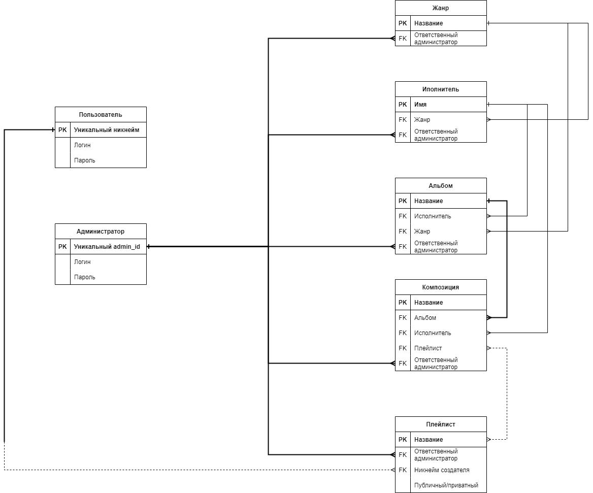

# Music library database

**Проект по курсу "Базы данных" Криворучко Дмитрия Игоревича студента второго курса ФАЛТ (ПИШ РПИ) МФТИ**

## Описание

В этом проекте описывается информационная система (но без взаимодействия с возможными фронт- или бэкендом) небольшого сайта по получению информации о композициях некоторых популярных рок-исполнителей, а также возможных пользовательских плейлистах.

### ER-diagram 

### UML classes diagram

### Use case diagram

### SIPOC's

* Процесс модерации композиций/альбомов/исполнителей/плейлистов на сайте

* Процесс поиска композиций/альбомов/исполнителей/плейлистов на сайте

* Процесс создания пользовательского плейлиста на сайте

